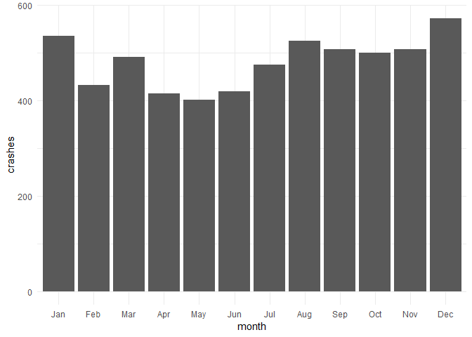
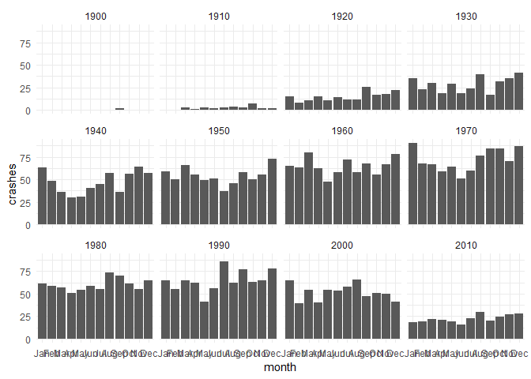
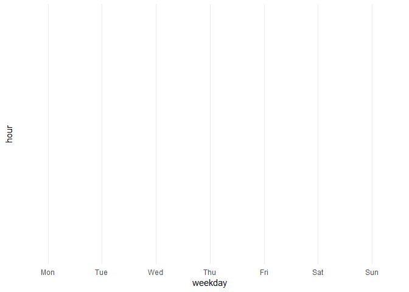
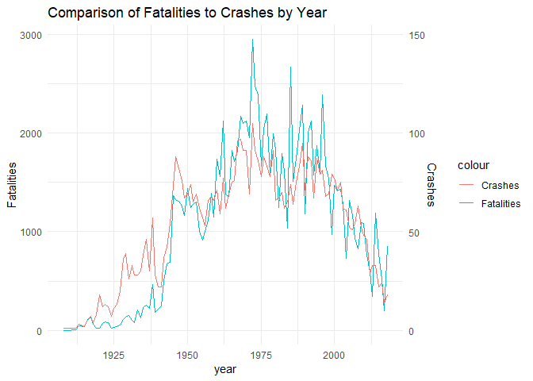

An Exploration of Plane Crashes from 1908-2018
================
David Holt
12/11/2018

Data
----

This data comes from the database at <http://www.planecrashinfo.com/database.htm>, maintained by Richard Kebabjian.

The aviation accident database includes: - All civil and commercial aviation accidents of scheduled and non-scheduled passenger airliners worldwide, which resulted in a fatality (including all U.S. Part 121 and Part 135 fatal accidents) - All cargo, positioning, ferry and test flight fatal accidents. - All military transport accidents with 10 or more fatalities. - All commercial and military helicopter accidents with greater than 10 fatalities. - All civil and military airship accidents involving fatalities. - Aviation accidents involving the death of famous people. - Aviation accidents or incidents of noteworthy interest.

Data Cleaning
-------------

Significant cleaning was done directly on the csv, due to the complexity of many of the variations in encoding. "?" entries are recoded as NAs.

``` r
data[] <- lapply(data, gsub, pattern = "?", replacement = NA, fixed = TRUE)

data_clean <-
  data %>%
  mutate(date = as.Date(data$date, format = "%B %d, %Y"),
         year = lubridate::year(date),
         decade = year - year %% 10,
         month = lubridate::month(date, label = TRUE),
         month = factor(month, levels = c("Jan", "Feb", "Mar", "Apr", "May", "Jun",
                                          "Jul", "Aug", "Sep", "Oct", "Nov", "Dec")),
         weekday = lubridate::wday(date, label = TRUE),
         weekday = factor(weekday, levels = c("Mon", "Tue", "Wed", "Thu", "Fri", "Sat", "Sun")),
         hour = lubridate::hour(as.Date(data$time, format = "%h:%m:%s")),
         aboard = as.numeric(aboard),
         fatalities = as.numeric(fatalities))
```

    ## Warning: package 'bindrcpp' was built under R version 3.4.4

    ## Warning in evalq(as.numeric(aboard), <environment>): NAs introduced by
    ## coercion

    ## Warning in evalq(as.numeric(fatalities), <environment>): NAs introduced by
    ## coercion

Visualize the data
------------------

``` r
data_clean %>%
  ggplot() +
  geom_histogram(aes(x = year), stat = "count") +
  theme_minimal()
```

    ## Warning: Ignoring unknown parameters: binwidth, bins, pad


We can see that the number of crashes increased steadily until the 1940s, remained somewhat steady until the 1990s, then steadily declined. Research into number of flights per year supports the idea that crashed scaled up with flights during the first period, that it remained steady in spite of an increase in flights during the second period, and that it declined in the third period in sharp contrast to an even greater increase in the number of total flights per year.

``` r
data_clean %>%
  group_by(month) %>%
  summarise(crashes = n()) %>%
  ggplot() +
  geom_histogram(aes(x = month, y = crashes), stat = "identity") +
  theme_minimal()
```

    ## Warning: Ignoring unknown parameters: binwidth, bins, pad



``` r
data_clean %>%
  group_by(month, decade) %>%
  summarise(crashes = n()) %>%
  ggplot() +
  geom_histogram(aes(x = month, y = crashes), stat = "identity") +
  theme_minimal() +
  facet_wrap(~decade)
```

    ## Warning: Ignoring unknown parameters: binwidth, bins, pad



At first glance, it looks like there may be more crashes on average in the non-spring months, but this is not the case when you look at individual decades, which show different patterns.

``` r
data_clean %>%
  ggplot() +
  geom_count(aes(x = weekday, y = hour)) +
  theme_minimal()
```

    ## Warning: Removed 5783 rows containing non-finite values (stat_sum).



It is clear that there are more crashes during the day, which is the result of there being fewer flights in the air during the day.

``` r
data_clean %>%
  group_by(year) %>%
  summarise(fatalities = sum(fatalities, na.rm = TRUE),
            crashes = n()) %>%
  ggplot() +
  geom_line(aes(x = year, y = fatalities, color = "Fatalities")) +
  geom_line(aes(x = year, y = crashes*20, color = "Crashes")) +
  scale_y_continuous(sec.axis = sec_axis(~./20, name = "Crashes")) +
  ylab("Fatalities") +
  ggtitle("Comparison of Fatalities to Crashes by Year") +
  theme_minimal()
```



We can see that fatalities and crashes are strongly related, and that, while there is variation, the average of about 20 fatalities per crash has held for the majority of the time period.
