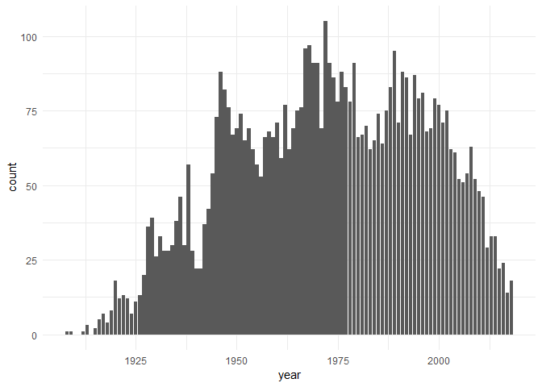

Clustering Life Expectancy
================
David Holt
12/11/2018

Dataset
-------

This data includes Life Expectancies by Country by Year from 1960 - 2015.

The data includes observations for regions, which I dropped.

``` r
data <-
  data %>%
  filter(!is.na(Region))
```

    ## Warning: package 'bindrcpp' was built under R version 3.4.4

Examining Countries divided by Region, there seem to be Regions that are very similar intra-Regionally, as well as Regions that are similar inter-Regionally. Rather than simply using Region, I would like to find out if there are more meaningful clusterings, and how those align with Region.

``` r
data %>%
  ggplot() +
  geom_line(aes(x = Year, y = `Life Expectancy`, color = Country), show.legend = FALSE) +
  facet_grid(~Region) +
  ylab("Life Expectancy") +
  ylim(0, NA) +
  theme_minimal()
```

    ## Warning: Removed 1095 rows containing missing values (geom_path).



Missing Data
------------

I investigated countries with missing years of data. Some were not countries during the entirety of the time period. There were few that had only a small number of missing years, and the number of total countries with missing data was only 28 of 207. For that reason, I removed those countries from the dataset.

``` r
data %>%
  group_by(Country, Region) %>%
  summarise(total_missing = sum(is.na(`Life Expectancy`))) %>%
  filter(total_missing != 0) %>%
  ggplot() +
  geom_boxplot(aes(x = Region, y = total_missing), outlier.colour="black", outlier.shape=16,
               outlier.size=2, notch=FALSE) +
  ggtitle("Number of Missing Years per Country (for Countries with Missing Years)") +
  ylab("Missing Years") +
  ylim(0, NA) +
  theme_minimal()
```


``` r
countries_with_missing_data <-
  data %>%
  group_by(Country) %>%
  summarise(total_missing = sum(is.na(`Life Expectancy`))) %>%
  filter(total_missing != 0) %>%
  pull(Country)

data_clean <-
  data %>%
  filter(!(Country %in% countries_with_missing_data))
```

Clustering
----------

I used three different clustering methods: Euclidean distance, Dynamic Time Warping and a model-based ARMA method. I chose Euclidean distance because DTW wasn't necessary (year-over-year differences weren't stretched or compressed) and the ARMA method produced far fewer clusters. You can see the distribution of Life Expectancies is very skewed left, which represents the presence of the two clusters lower than the majority of countries.

There is a very large cluster, but the two other clusters are both significantly sized.

``` r
hist(data_clean$`Life Expectancy`)
```


``` r
data_matrix <-
  data_clean %>%
  select(Year, Country, `Life Expectancy`) %>%
  spread(key = Year, value = `Life Expectancy`) %>%
  select(-Country) %>%
  as.matrix()

# Euclidean distance
dissimilarities_euclidean <-
  diss(data_matrix, "EUCL")

names(dissimilarities_euclidean) <-
  data_clean %>%
  select(Year, Country, `Life Expectancy`) %>%
  spread(key = Year, value = `Life Expectancy`) %>%
  pull(Country)

#perform hierachical clustering to the dist object
hc_eucl <- hclust(dissimilarities_euclidean)

#show the results
plot(hc_eucl)
```


``` r
clusters_euclidean <- cutree(hc_eucl, 3)

table(clusters_euclidean)
```

    ## clusters_euclidean
    ##   1   2   3 
    ##  36 110  43

Initial Results
---------------

We can see that the two clusters with lower than average Life Expectancy are both largely made up of Sub-Saharan countries. Research revealed that both wars and medical epidemics affected those countries, as well as the Northern African and Pacific countries included in the Middle Life Expectancy clusters.

``` r
data_clean_clustered <-
  data_clean %>%
  inner_join(tibble(Country = names(clusters_euclidean),
                    cluster = as.vector(clusters_euclidean)))
```

    ## Joining, by = "Country"

``` r
data_clean_clustered$cluster <-
  data_clean_clustered$cluster %>%
  recode(`1` = "Low", `3` = "Mid", `2` = "High")

data_clean_clustered %>%
  group_by(Region, Country, cluster) %>%
  summarise() %>%
  group_by(Region) %>%
  summarise(`Low Life Expectancy` = sum(cluster == "Low"),
            `Middle Life Expectancy` = sum(cluster == "Mid"),
            `High Life Expectancy` = sum(cluster == "High"))
```

    ## # A tibble: 7 x 4
    ##   Region         `Low Life Expecta~ `Middle Life Expec~ `High Life Expect~
    ##   <chr>                       <int>               <int>              <int>
    ## 1 East Asia & P~                  2                   8                 21
    ## 2 Europe & Cent~                  0                   1                 47
    ## 3 Latin America~                  0                   7                 27
    ## 4 Middle East &~                  1                   8                 10
    ## 5 North America                   0                   0                  2
    ## 6 South Asia                      3                   4                  1
    ## 7 Sub-Saharan A~                 30                  15                  2

Graphical Results
-----------------

We can see that the countries in the High Life Expectancy cluster have moved together, though across a wide number of starting Life Expectancies. For countries with Low Life Expectancies, they are primarily clustered based on their low initial life expectancy, but they also are countries that suffered from negative effects during the 1970s-1990s. Finally, those countries with Mid Life Expectancies include countries like Iraq and Afghanistan, which saw significant effects from wars in the 2000s.

``` r
data_clean_clustered %>%
  ggplot() +
  geom_line(aes(x = Year, y = `Life Expectancy`, color = Country), show.legend = FALSE) +
  facet_grid(~cluster) +
  theme_minimal()
```


